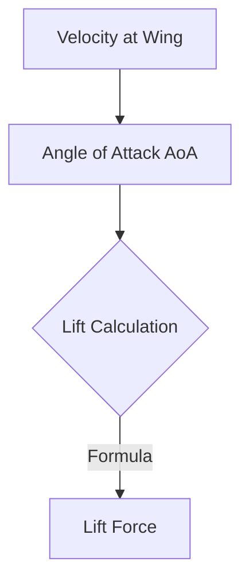

# Physics System

Aviassembly uses Unity's `Rigidbody` physics combined with a custom aerodynamic simulation.

## Drag Simulation
Drag is calculated globally using a camera-based projection technique, simulated in `DragSimulator.cs`.

### Global Drag Logic
The game renders the aircraft from the front (relative to airflow) using a replacement shader to calculate the "Projected Area".
1.  **Projected Area**: A secondary camera (`DragFactorCalculationCamera`) renders the plane's depth and silhouette.
2.  **Pixel Analysis**: The render texture is analyzed to count the number of pixels taken up by the aircraft.
3.  **Drag Factor**:
    ```csharp
    DragFactor = (PixelCount / TotalPixels) * (Width * Height) * DragMultiplier
    ```
4.  This `DragFactor` is applied as a resistive force opposite to velocity.

### Retractable Gear
The system calculates drag twice per frame:
1.  With Landing Gear **Extended**.
2.  With Landing Gear **Retracted**.
This allows the physics engine to apply the correct drag profile dynamically based on the gear state.

## Lift (Aerodynamics)
Per-part lift is calculated in individual components like `Wing.cs`.

### Wing Lift
Lift force is applied to the `Rigidbody` at the `LiftOrigin` (Lerped between Wing position and CoM).

**Formula**:


See [Aerodynamics](../systems/aerodynamics.md) for the exact math.

## Structural Integrity
Parts have a `Strength` rating defined in `PartStats`.
*   **Stress Warning**: If `Airflow Magnitude > MaxSpeed * 0.8`, a warning is shown.
*   **Structural Failure**: If `Airflow Magnitude > MaxSpeed`, the part calls `PartExploder.ExplodePart()`.
